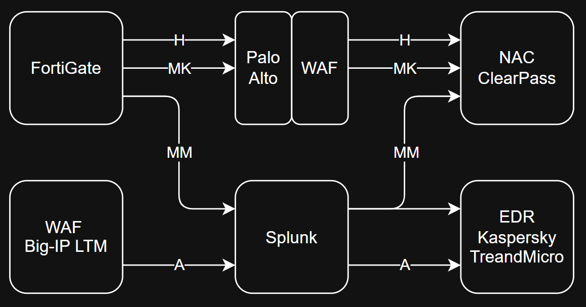

## Courses

| Topic                | Resource                                                                                           |
| -------------------- | -------------------------------------------------------------------------------------------------- |
| CCNA                 | https://www.youtube.com/playlist?list=PLyDiLBk6tDH48IAmjAfH8OhrIeTSf23id                           |
| Active Directory     | https://youtube.com/playlist?list=PLVYsVvv9O3sqogZZ3AfClgm67cvMDdPx7                               |
| eCIR                 | https://netriders.academy/all-courses/incident-response                                            |
 

## Security Solutions

| Solution             | Resource                                                                                           |
| -------------------- | -------------------------------------------------------------------------------------------------- |
| FortiGate FW         | https://www.youtube.com/playlist?list=PLuAmHWtEqECumCpFNlhrXbTX-yErP3kqR                           |
| Palo Alto FW         | https://youtube.com/playlist?list=PLLlr6jKKdyK2IzNFNSl-ACoFvaFAe49v1                               |
| F5 BIG-IP WAF        | https://www.udemy.com/course/big-ip-local-traffic-managerltm-v16-training                          |
| Splunk SIEM          | https://www.udemy.com/course/the-complete-splunk-core-certified-user-course-splk-1001              |
|                      | https://www.udemy.com/course/the-complete-splunk-core-certified-power-user-course                  |
|                      | https://www.udemy.com/course/splunk-enterprise-certified-admin-splk-1003-course                    |
| ClearPass NAC        | TBD                                                                                                |
| EDR                  | TBD                                                                                                |
 

## Additional Solutions

| Solution             | Resources                                                                                          |
| -------------------- | -------------------------------------------------------------------------------------------------- |
| Forti Manager        | TBD |
| Trend Micro IPS      | TBD |
 

